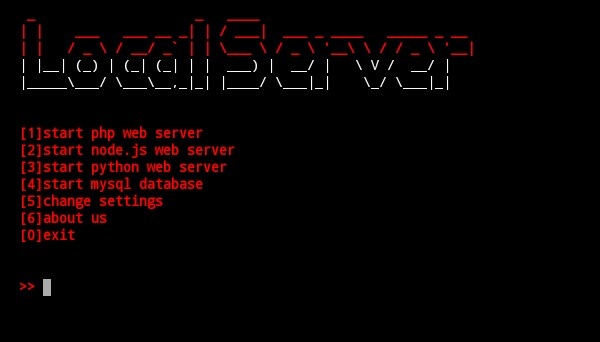

# server
this is simple script that you can start `php` , `python` , `node.js` , `mysql database` server.  

once you start server , for next time it won't ask you for _root directory_ and _port_ and it use your first time information.
you can change this information in settings
### installation
1.`git clone https://github.com/Mouod59/server.git`  
2.`cd server`  
3.`chmod +x server`  
4.`./server`  
##### you can move `server` file to bin directory for easy use
`mv server /bin`
##### then you can run script with `server`  
### tutorial
1.**root directory** : the directory thet your codes have been there
2.**port : look at this address `localhost:`**

